# FIGHT NIGHT

A complete, playable **Fortnite-style battle royale that runs in your browser**, written in
**Rust → WebAssembly** and rendered with **WebGPU**. Characters, weapons, items and nearby vegetation
are authored in **Blender** and baked into the game. The island, towns, UI icons and sounds are generated
in code. The [free original cartoon asset pack](assets/cartoon/README.md) includes editable Blender
source, rigged GLBs and seven animation clips; Scout, Ranger, Pilot and Vanguard are selectable in the menu.

* Drop from the **Battle Bus** (hot-air balloon and all), skydive and glide onto the island.
* **Third-person shoulder camera**, smooth movement, sprint / crouch / jump / swim, **aim down sights**,
  weapon bloom and recoil, **reloading**, headshots and damage falloff.
* **39 enemy bots** (adjustable) that land, loot, heal, build cover, fight and run from the storm.
* **Three modes**, selectable for solo play and by the multiplayer host: Battle Royale, **Zero Build**
  (no player or bot construction and no building materials), and **LEGO** (original brick toy characters,
  gear, vegetation, studded terrain and build pieces, with battle royale rules).
* **Drivable Island Buggies** parked around the island. Enter or leave with **E**, drive with **WASD**,
  boost with **Shift** and brake with **Space**. Driver seats, collisions and physics are owned by the host.
* **Multiplayer**: one player hosts a room, up to seven friends join with a copy-and-paste code (no server, no
  account: the browsers connect to each other over WebRTC), and bots fill the island. See [Multiplayer](#multiplayer).
* **Loot**: chests (about 60 inside buildings and 56 spread across the open island, in the hills, forests and
  on the coast), floor weapons with rarity beams (common → legendary), ammo, bandages, medkits, shield potions,
  Chug Jugs. 5 hotbar slots + pickaxe, health + shield, materials. With a full hotbar **E** swaps the item on the
  ground with the one in hand, and a click on a healing item that has nothing to heal says why.
* **Supply drops**: a few times a match a **blue supply crate** comes down on a parachute inside the next safe
  circle, marked by a tall blue beam, a minimap marker and a "Supply drop incoming" call-out. Open it (**E**) for
  two epic or legendary weapons with ammo, a Chug Jug or shield potions and a medkit. Bots go for it too, so
  expect company.
* **Building**: walls, floors, ramps and roofs on a Fortnite-style grid in wood, stone and metal — ramp-rush
  up cliffs, box yourself in, and watch bullets and rockets chew through your pieces.
* **Harvesting**: hit trees (wood), grey rocks (stone) and the blue-grey ore rocks (metal) with the pickaxe (trees really fall over).
* **Shrinking storm** in 7 phases that forces everyone together, with a minimap, full map and storm timer.
* A **1,920 × 1,920 m island**, 2.25× the former area, with grassy hills, forests, three lakes,
  a snowy mountain, beaches and up to 18 named destinations connected by roads.
* Fortnite-flavoured lighting (cascaded shadow maps, bloom, ACES grading, soft sky and clouds), procedural
  character animation (run/crouch/air/swim/glide cycles, IK-held weapons, reload and swing animations, a
  dance emote and a victory dance) and a Canvas2D HUD in the same visual language (compass, minimap, skewed
  health/shield bars, rarity-coloured hotbar, kill feed, hit markers, damage numbers, victory screen with
  confetti).

## Screenshots

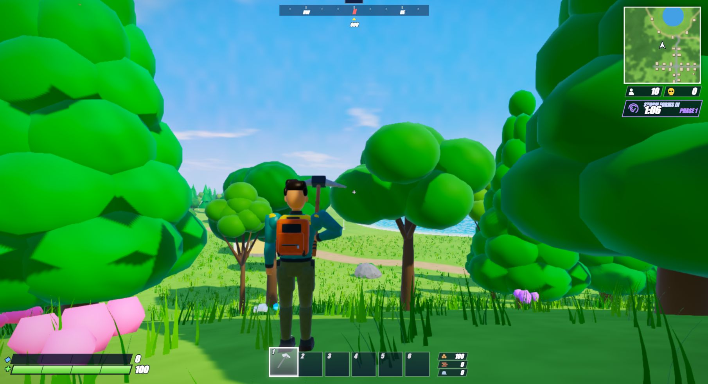
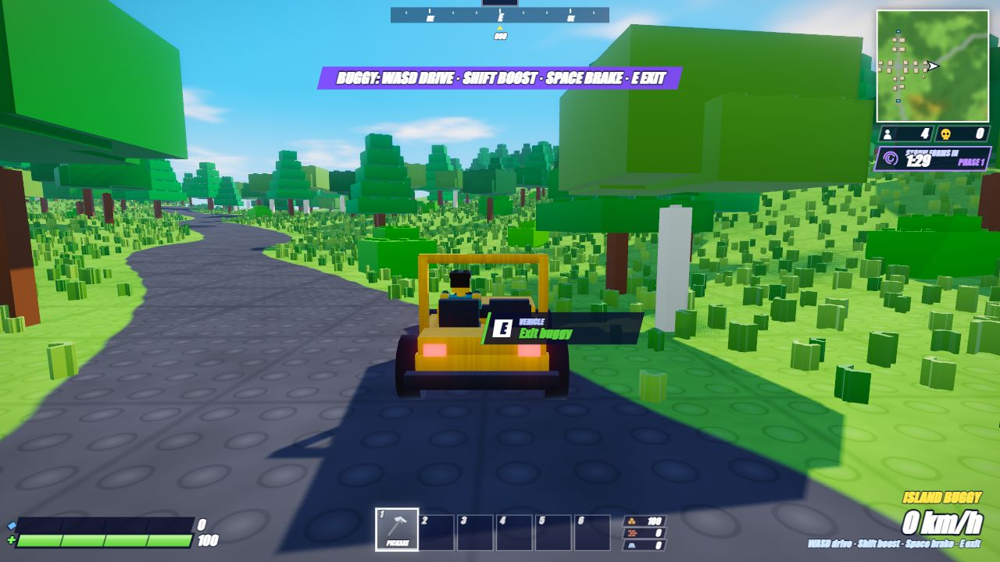

| | |
| --- | --- |
| 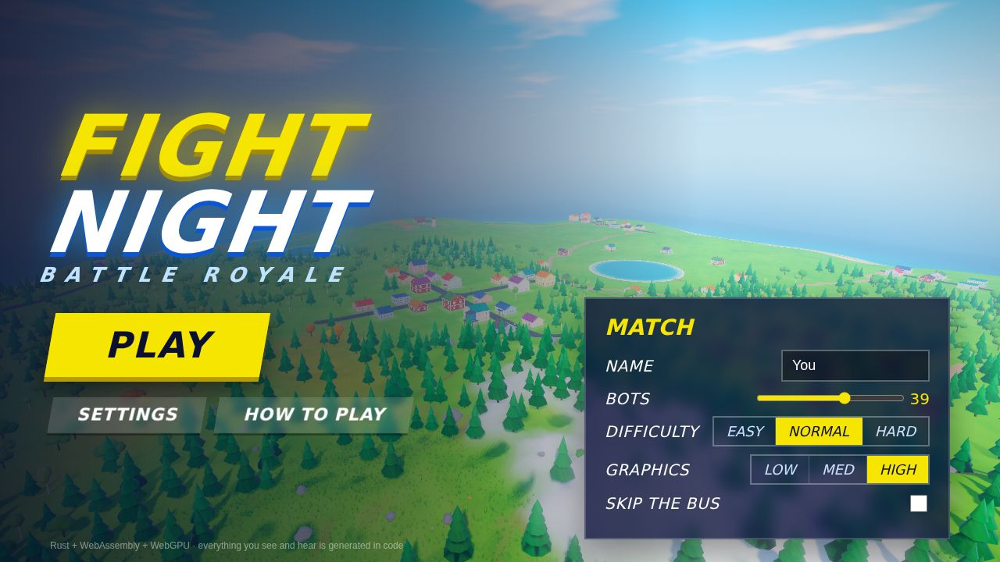 | 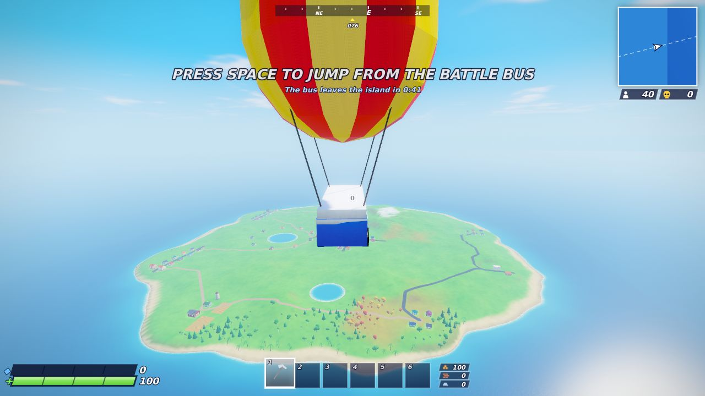 |
| 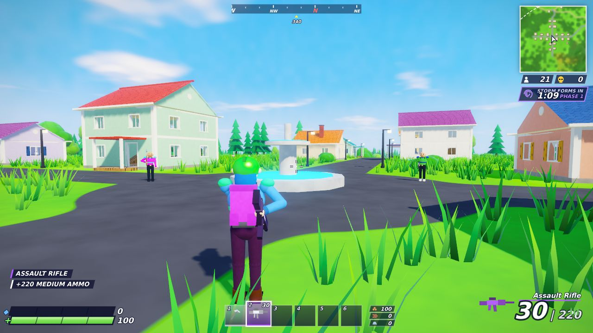 | 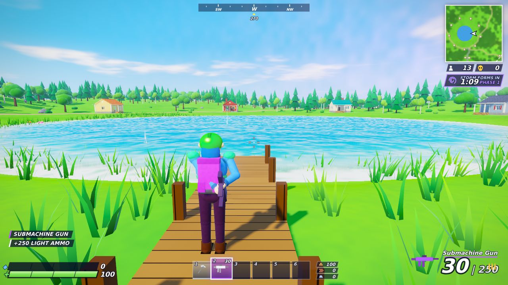 |
| 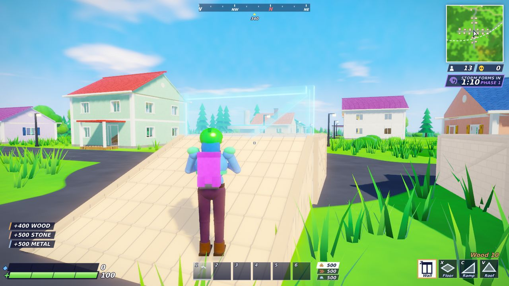 | 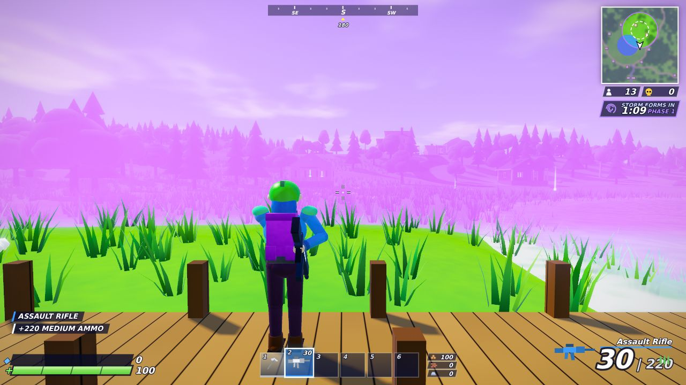 |
| 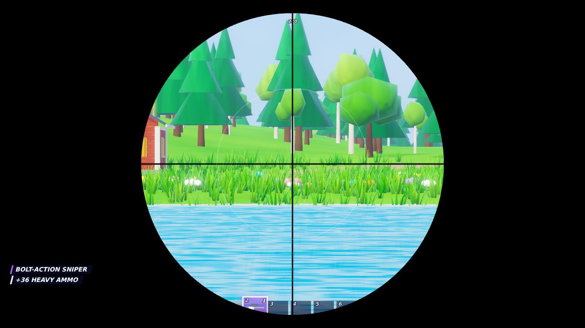 | 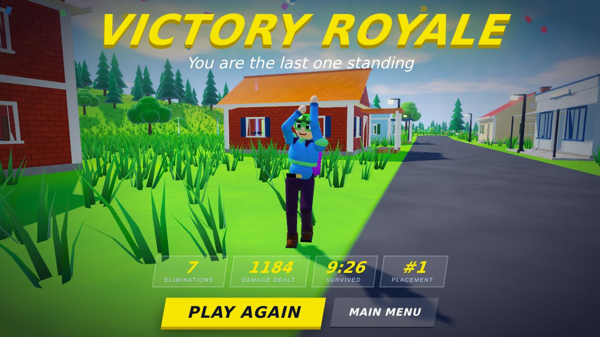 |
| 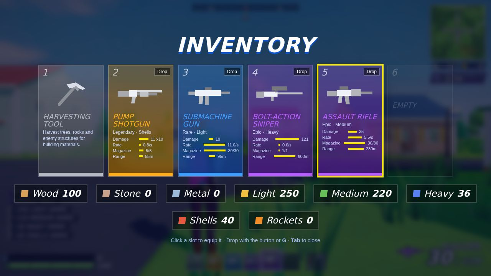 | 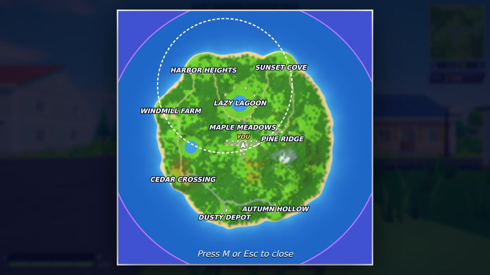 |

(Regenerate them with `tools/screenshots.sh`.)

## Play

You need a browser with WebGPU (Chrome / Edge 113+, Safari 18+, recent Firefox) and a GPU.

```bash
# one-time setup
rustup target add wasm32-unknown-unknown
cargo install wasm-bindgen-cli --version 0.2.129   # must match the wasm-bindgen crate version

# build the game into ./dist and serve it
scripts/build.sh                       # release build (use `scripts/build.sh dev` for a fast debug build)
python3 -m http.server -d dist 8080    # or any static file server
# open http://localhost:8080
```

`dist/` is a plain static site, so any static host works (WebGPU needs HTTPS or `localhost`). The repository
ships a CI workflow (tests, clippy, wasm build) and a manual **Deploy to GitHub Pages** workflow: enable
*Settings → Pages → Source: GitHub Actions*, then run it from the Actions tab. Building needs Rust 1.87 or newer.

### Controls

| Key / mouse | Action |
| --- | --- |
| `W A S D` / mouse | Move / look |
| `Shift` (auto-sprint on by default) | Sprint |
| `Space` | Jump · leave the bus · open the glider |
| `Ctrl` or `F` | Crouch (browsers reserve Ctrl+W and Ctrl+1–6, so `F` is safer; fullscreen captures them too) |
| Left mouse | Fire · swing the pickaxe · place the selected piece |
| Right mouse | Aim down sights |
| `R` | Reload |
| `E` | Pick up (with a full hotbar, swaps with the item in hand) / open chest / enter or exit a buggy |
| `W A S D`, `Shift`, `Space` (driving) | Steer and accelerate / boost / brake |
| `1`–`6` / wheel | Select slot (1 is the pickaxe) |
| `G` | Drop the selected item |
| `Q` | Toggle build mode |
| `Z` `X` `C` `V` | Wall · Floor · Ramp · Roof |
| `T` | Cycle building material (wood / stone / metal) |
| `B` | Dance emote (any other action ends it; the winner dances automatically) |
| `Tab` | Inventory |
| `M` | Map |
| `Esc` | Pause |
| `F3` | Performance overlay |

Tips: hold forward and click with a ramp selected to ramp-rush up a cliff; walls block bullets, so build
cover before you heal; the next safe circle is the dashed white ring on the map.

## Multiplayer

Press **Multiplayer** in the main menu.

* **Host a game** opens your room. Press *+ Invite a player* for every friend: it makes an **invite code**; send it
  to them (chat, mail, anything). They choose **Join a game**, paste it, press *Continue*, and send back the
  **reply code** they get. Paste that into the matching box on your side and press *Connect*: they appear in
  the player list. The **room creator is the host**. When everybody is in, choose the mode,
  number of bots and difficulty and press **Start match**. Every guest uses those match rules.
* **Join a game**: paste the host's invite, send back your reply, and wait for the host to start.

Everybody drops from the same Battle Bus into the same island; the last one standing (human or bot) wins. If a
player leaves or loses their connection, a bot takes over their character. Eliminated players can spectate.

How it works: the host's browser is the authority. It runs the whole simulation, with the people in the room as
extra human actors beside the bots, and sends each player 30 snapshots a second plus every change to the loot,
chests (including each supply drop as it is let go) and buildings and the one-shot events (shots, hits, pickups) that player could see or hear. Each guest
runs its own copy of the match: its own character is **predicted** with the very same movement code the host
runs and corrected from the host's acknowledgements (the controls never wait for the network), the others are
**interpolated** about 100 ms in the past, and the HUD, sounds and effects work on that copy exactly as they do
in a single-player match. Messages are a small hand-written binary format over two WebRTC data channels per
player (one reliable and ordered, one unreliable for commands and snapshots); `crates/fn-core/src/net/` has the
protocol, the host, the guest and tests that drive them through a simulated lossy network.

Limits: connections are direct, so two players behind strict (symmetric) NATs may not be able to reach each other
(there is no relay server; a public STUN server is used to find addresses); the match cannot be joined once it has
started; shots are lag-compensated (checked against where the target was on the shooter's screen, up to a quarter of a second
back), but a very slow connection will still feel it; and the host has the advantage of zero latency.
The host's browser runs the match, so it has to stay open and in the foreground: a hidden tab is slowed down by the
browser and everybody else's match slows with it.

## How it is put together

```
crates/
  fn-core/     platform-independent game: math, noise, world generation, simulation, bots, models,
               procedural audio synthesis, input mapping, shadow cascades, HUD/audio mapping. Compiles natively,
               so almost everything is unit tested without a browser.
    src/world/   island: terrain + biomes, lakes, roads, towns and buildings, props, colliders, nav grid, minimap
    src/game/    actors, movement/physics, combat, loot, building pieces, storm + bus, bot AI, rig (animation),
                 scene (draw lists), fx (particles), hud (JSON snapshot), audio_map (positional cues),
                 cmd + remote (the commands a networked player sends and how the host applies them)
    src/net/     multiplayer: wire format, protocol, the host (room + authoritative match), the guest's lobby and
                 predicted copy of the match; no I/O, so it is tested natively through an in-memory network
    src/models.rs, meshlib.rs   every mesh in the game (characters, weapons, items, trees, building pieces...)
    src/cartoon_assets.rs       embedded Blender meshes and sampled locomotion keyframes
    src/audio_synth.rs          all sound effects synthesised from oscillators and noise
  fn-shaders/  WGSL shaders (+ a naga validation test so a shader typo fails `cargo test`)
  fn-web/      the wasm module: wgpu WebGPU renderer, app loop, and the exports used by the page
web/           index.html, CSS and the JS for menus, HUD drawing (Canvas2D), icons and WebAudio playback;
               net.js / multiplayer.js: WebRTC data channels, invite codes and the lobby screens
scripts/       build script (cargo → wasm-bindgen → dist/)
tools/         headless-Chromium helpers: screenshots and the end-to-end tests
assets/cartoon/ editable Blender source, rigged GLBs, baked mesh buffers and animation curves
```

Rendering notes: reverse-Z infinite projection into an HDR (RGBA16F) MSAA target, 3-cascade shadow maps,
instanced meshes batched per model (a few hundred draw calls), CPU-culled props and grass, procedural
terrain/sky/water/storm shaders, bloom + FXAA + ACES composite. Quality presets (Low / Medium / High) trade
resolution scale, MSAA, shadow resolution, bloom and draw distance.

The simulation runs at a fixed ≤1/60 s step shared by the player and bots (bots only produce an `Intent`,
exactly like the keyboard does), so the same rules apply to everyone.

## Tests

```bash
cargo test --release                       # ~300 unit/integration tests (simulation, bots, models, input, shaders, ...)
cargo test --release -- --ignored monkey   # long randomised "monkey" soak test over many seeds
cargo run --release -p fn-core --example soak -- 39 700 1 bus   # a bots-only match with a timeline
cd tools && npm install && npm test       # real-browser tests (needs `scripts/build.sh` first):
                                           #   e2e.mjs      gameplay: move, shoot, reload, build, harvest, chests, kills...
                                           #   e2e_flow.mjs UI state machine with the real pointer lock: pause, win, spectate...
                                           #   mp_e2e.mjs   two browsers host/join through the real invite codes over WebRTC
                                           #   supply_e2e.mjs  a supply drop falls, lands, shows on the HUD and is opened with E
                                           # npm run fuzz   random keys/clicks/blur/lock releases against the UI state machine
```

`tools/` also has `ui_shot.mjs` (the real page with all its UI) and `game_shot.mjs` (the UI-less harness page
`web/dev.html`, with crop/zoom and multi-frame series options) for scripted screenshots; the WebGPU frame is
read back explicitly because headless Chromium cannot screenshot a WebGPU canvas. The page exposes a small debug
console (`window.__game.fn.debug("tp 52 28")`, `give ar epic`, `chest_here`, `build_demo`, `ff 120`, ...) that
the harnesses use.

To run the browser tests on a Windows desktop with a real WebGPU-capable GPU:

```powershell
cd tools
npm ci
$env:CHROME_PATH = 'C:\Program Files\Google\Chrome\Application\chrome.exe'
$env:FN_FLAGS = 'native'
npm test
```

The native GPU mode waits for simulation time as well as rendered frames, so fast
hardware gets the same movement, reload and harvesting durations as software rendering.

## Notes and limitations

* Multiplayer is peer-to-peer with hand-exchanged codes: no matchmaking, no relay server, no late joining
  (see [Multiplayer](#multiplayer)). There is no structure editing.
* Desktop only (keyboard and mouse). Quality presets exist because GPUs vary: if the frame rate stays under
  roughly 30 fps for a few seconds the game steps the preset down by itself (never up; switch it off in
  Settings).
* Development was done on a machine without a GPU: the browser tests and screenshots run in headless
  Chromium with software WebGPU (SwiftShader), so frame rates on real hardware have not been measured.
  The CPU side (simulation, scene building, draw submission) costs roughly 1–2 ms per frame with 39 bots.
* The original cartoon art combines editable Blender models with generated scenery and materials.
  The solo menu offers four outfit palettes; they share one body mesh and use the gameplay animation rig.

## Licence

MIT, see [LICENSE](LICENSE).
